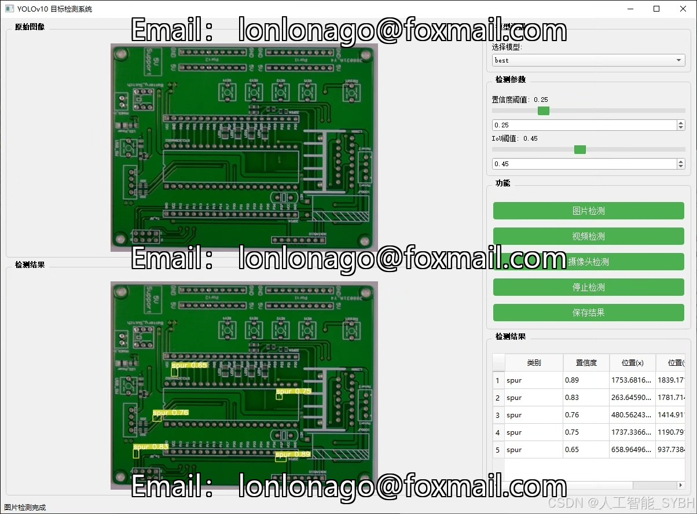
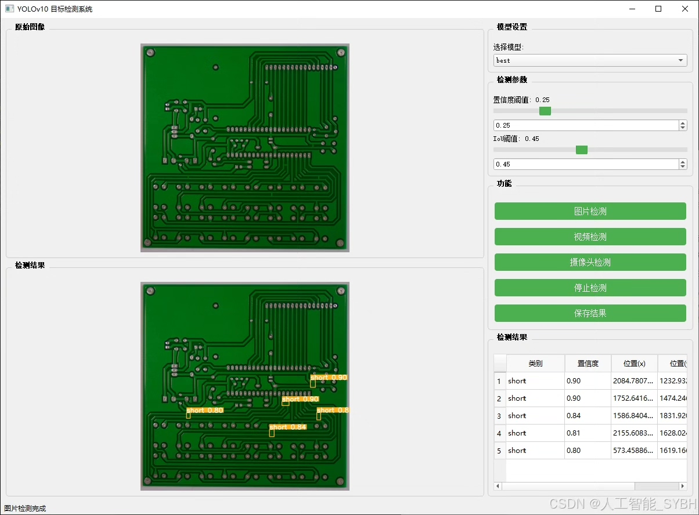
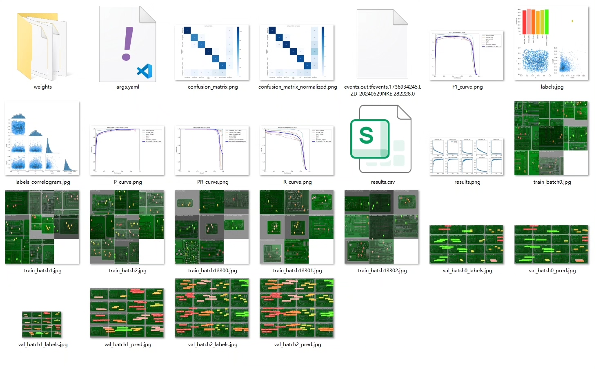
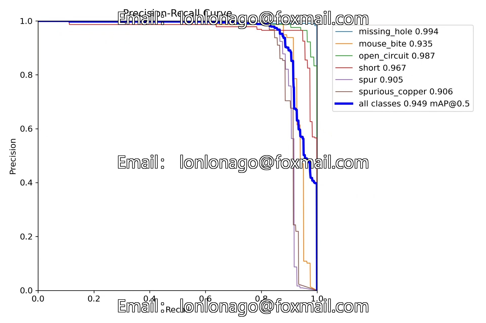
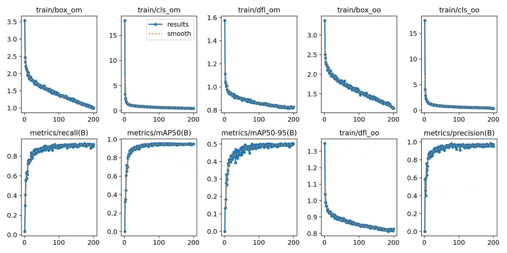
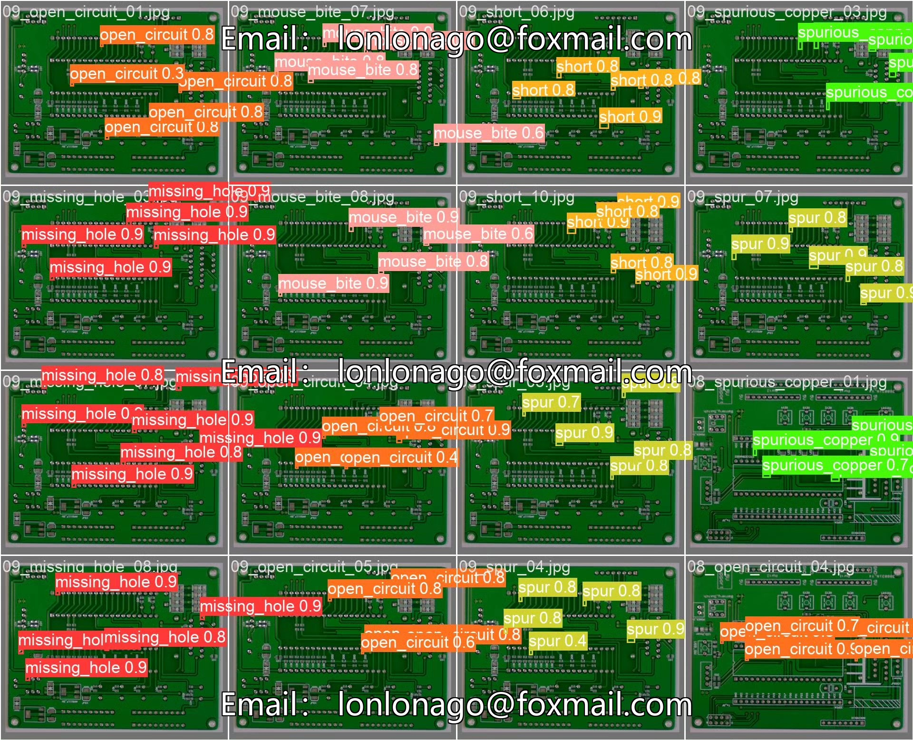
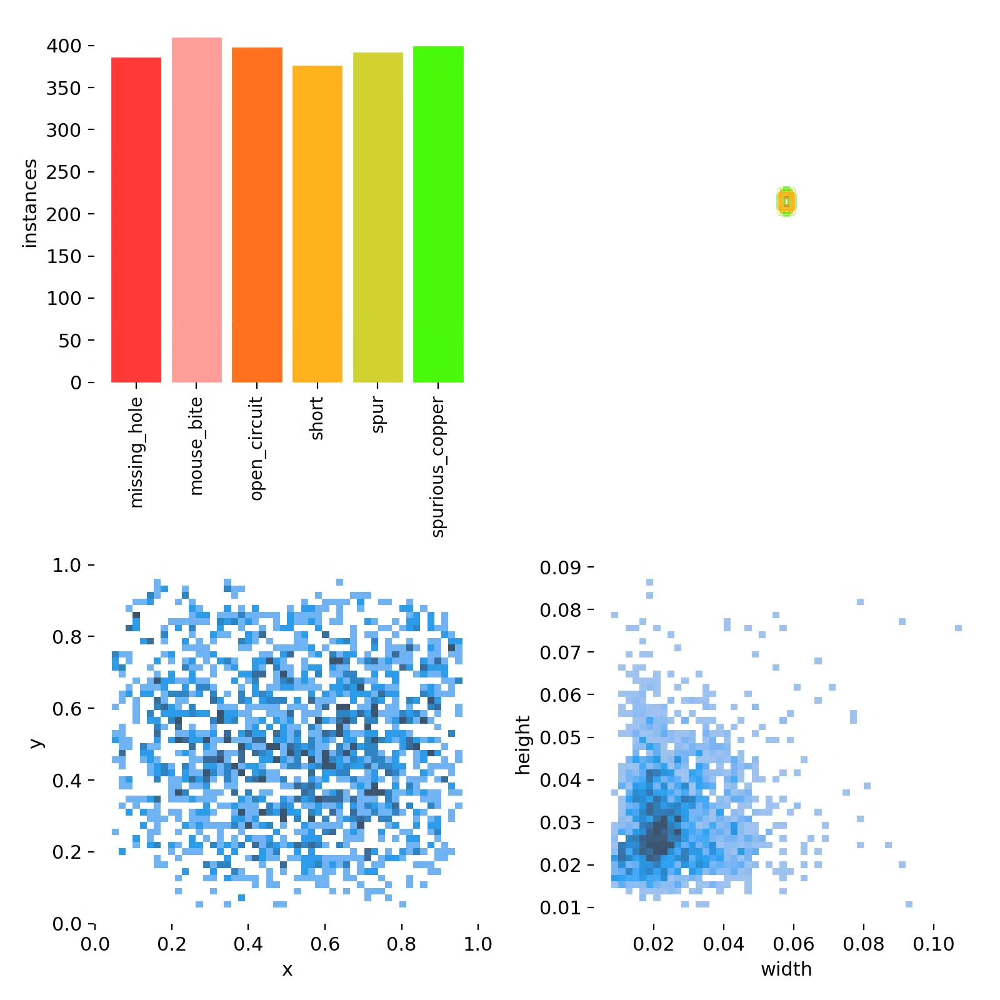
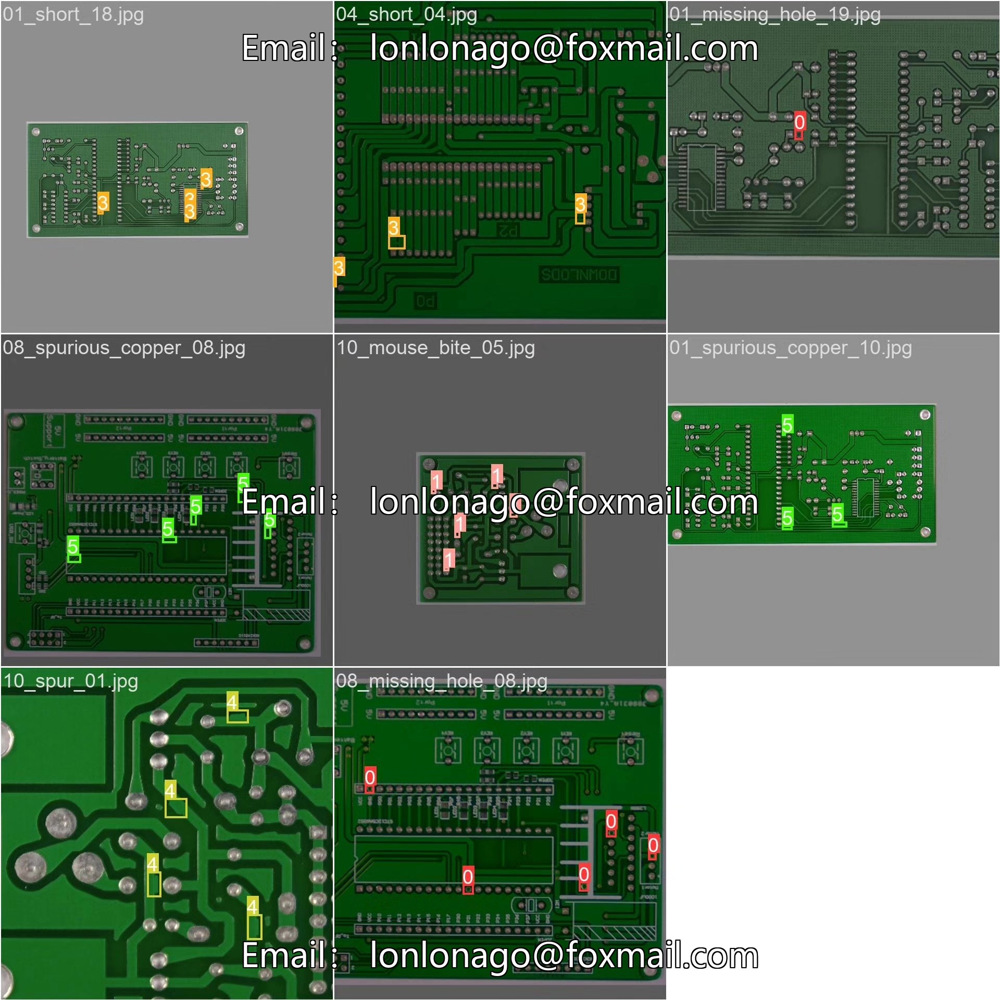

# Based on deep learning YOLOv10 for PCB board defect detection system (YOL

## Body

Based on deep learning YOLOv10, a PCB board defect detection system (YOLOv10+YOLO dataset + UI interface + Python project source code + model)

In the electronic manufacturing industry, the quality inspection of printed circuit boards (PCBs) is a crucial link to ensure the reliability of electronic products. Traditional PCB defect detection methods rely on manual visual inspection or automated optical inspection (AOI) equipment, which are inefficient and costly. A computer vision-based PCB defect detection system can automatically and efficiently identify various defects in PCBs, thereby improving production efficiency and product quality. This project utilizes the YOLOv10 object detection algorithm to achieve automatic detection of six common PCB defects (leaks, mouse bites, open circuits, short circuits, burrs, and mixed copper).

The company's products have obtained YOLO official commercial license certification.

Package after-sales service: After payment, we will provide WeChat ID for instant questions and answers.

Environmental configuration: We will provide an instructional tutorial for setting up the environment, with WeChat available for Q&A.
Remote installation service: If you need remote configuration, an additional fee of 69 is required, with all fees refunded if the configuration fails (only reimbursement for old computers).

Retraining dataset: Once the environment is set up, you can train on your own computer. If you need us to retrain, just pay 69 plus computational power fees (2.5 yuan/hour).

Full after-sales service

## Images

## Payment

Here is a pay link on Stripe ( https://buy.stripe.com/3cs8yP7sY87d0vu9AB ). Please contact me lonlonago@foxmail.com after funding $89, and I will send you a complete data files , thank you!

